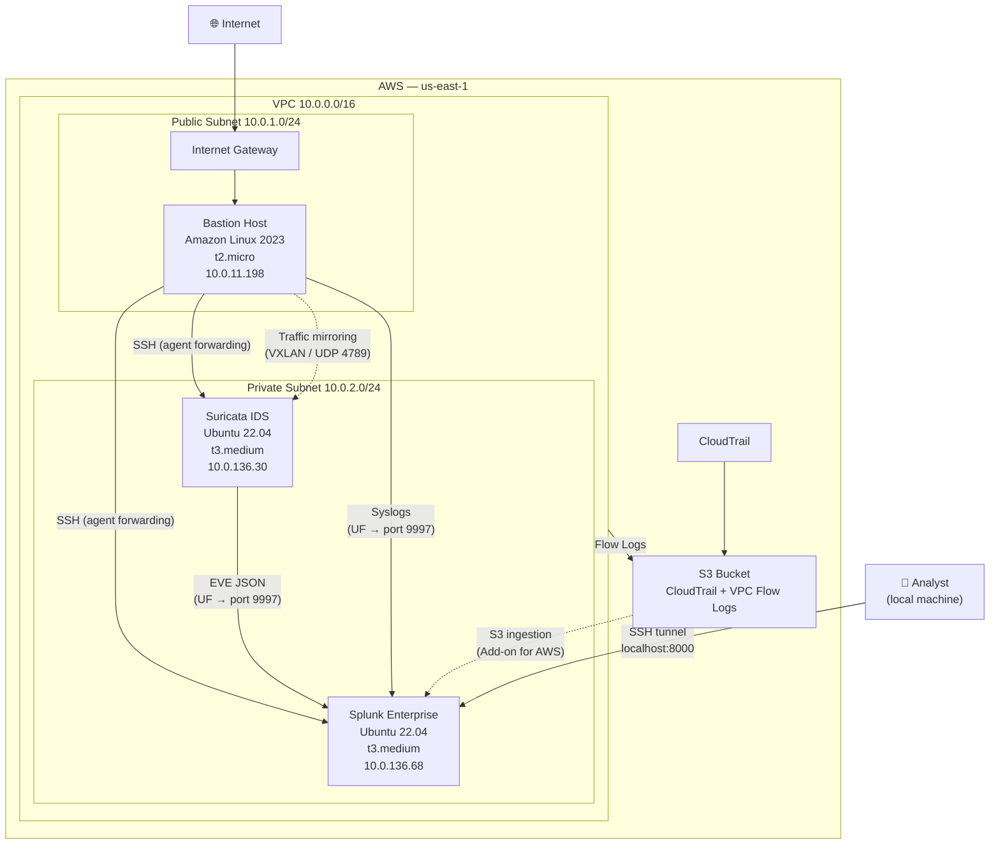

# aws-soc
My hands-on Security Operations Center (SOC) built entirely on AWS. This project documents the step-by-step build of a cloud-native SOC environment including network infrastructure, intrusion detection, and centralized log management.

---

## Project Status

| Phase | Description | Status |
|-------|-------------|--------|
| Phase 1 | AWS Foundations (VPC, IAM, CloudTrail, Flow Logs) | ✅ Complete |
| Phase 2 | IDS/IPS with Suricata | ✅ Complete |
| Phase 3 | Splunk Deployment & Log Ingestion | 🔄 In Progress |
| Phase 4 | Alerting & Correlation | 🔜 Upcoming |
| Phase 5 | Attack Simulation & Detection | 🔜 Upcoming |

---

## Network Architecture



---

## What's Built

### Phase 1 — AWS Foundations
- AWS account hardened with MFA on root and IAM admin user
- Non-root IAM user (`soc-admin`) for all day-to-day operations
- VPC (`10.0.0.0/16`) with public and private subnets, Internet Gateway, and NAT Gateway
- Bastion host in the public subnet — only SSH entry point into the private network
- CloudTrail enabled and shipping to S3
- VPC Flow Logs enabled on the VPC, shipping to S3
- Billing alert configured

### Phase 2 — IDS/IPS with Suricata
- Suricata EC2 (`t3.medium`) deployed in the private subnet
- Dedicated mirror ENI attached for receiving mirrored traffic
- Suricata installed from the OISF PPA (latest stable)
- VPC Traffic Mirroring configured — mirrors bastion ENI traffic to Suricata
- Emerging Threats Open ruleset enabled via `suricata-update` (40,000+ rules)
- EVE JSON logging enabled at `/var/log/suricata/eve.json`
- Custom local rules written for ICMP, SSH scanning, and SQLMap detection
- Log rotation configured via `logrotate`
- Verified: nmap scan and `testmynids.org` curl generate alerts in EVE log

### Phase 3 — Splunk Deployment & Log Ingestion *(in progress)*
- Splunk Enterprise 10.2.2 installed on dedicated Ubuntu EC2 (`t3.medium`, 50 GB)
- Receiving port 9997 enabled
- Indexes created: `suricata`, `aws_flowlogs`, `aws_cloudtrail`, `linux_os`
- Universal Forwarder installed on Suricata instance — shipping EVE JSON + syslog
- Universal Forwarder installed on bastion — shipping audit log
- Verified: `index=suricata` and `index=linux_os` both returning events in Splunk

---

## Stack

| Component | Technology |
|-----------|------------|
| Cloud provider | AWS (Free Tier + minimal paid services) |
| Network | VPC, subnets, Internet Gateway, NAT Gateway, VPC Traffic Mirroring |
| IDS | Suricata 7.x (OISF PPA) |
| Ruleset | Emerging Threats Open |
| SIEM | Splunk Enterprise 10.2.2 |
| Log forwarding | Splunk Universal Forwarder 10.2.2 |
| OS | Amazon Linux 2023 (bastion), Ubuntu 22.04 LTS (Suricata, Splunk) |
| SSH access | Key-based auth with agent forwarding through bastion |

---

## Data Sources

| Source | Method | Splunk Index |
|--------|--------|--------------|
| Suricata EVE JSON | Universal Forwarder | `suricata` |
| Linux syslogs (all EC2s) | Universal Forwarder | `linux_os` |
| VPC Flow Logs | S3 → Splunk Add-on for AWS | `aws_flowlogs` |
| CloudTrail | S3 → Splunk Add-on for AWS | `aws_cloudtrail` |

---

## Accessing Splunk UI

Splunk runs in the private subnet. Access it via SSH tunnel through the bastion:

```bash
ssh -A -i ./aws/soc-lab-key.pem \
  -L 8000:<SPLUNK_PRIVATE_IP>:8000 \
  ec2-user@<BASTION_PUBLIC_IP> -N
```

Then navigate to `http://localhost:8000` in your browser.

---

## Security Notes

- Root account access keys are disabled; MFA is enabled
- All private instances are inaccessible from the internet — SSH access flows through the bastion only
- Bastion security group restricts port 22 to a single trusted IP
- No credentials, keys, or sensitive values are stored in this repository
