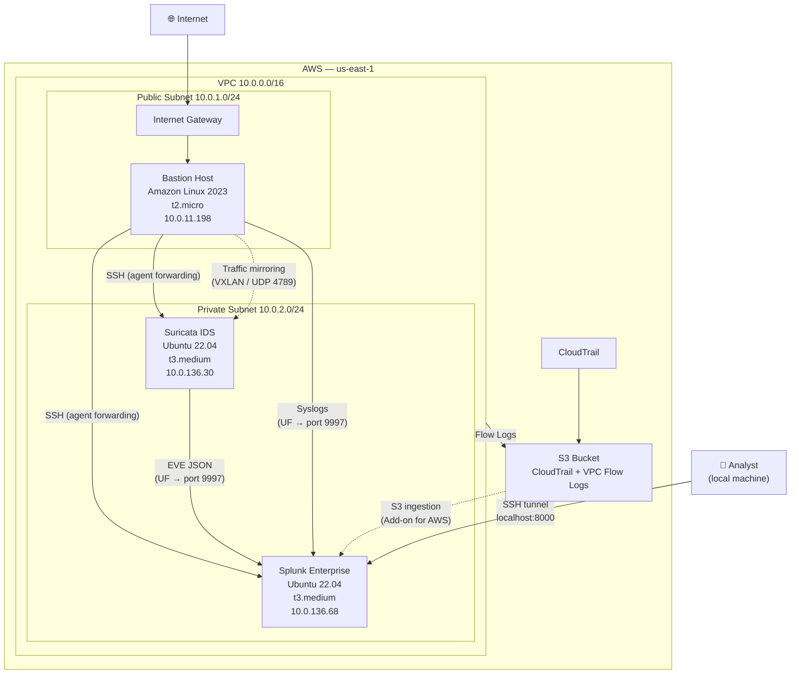

# aws-soc

A hands-on Security Operations Center (SOC) built entirely on AWS. This project demonstrates the design and deployment of a cloud-native SOC environment, covering network infrastructure, intrusion detection, and centralized log management.

---

## Project Status

| Phase | Description | Status |
|-------|-------------|--------|
| Phase 1 | AWS Foundations (VPC, IAM, CloudTrail, Flow Logs) | ✅ Complete |
| Phase 2 | IDS/IPS with Suricata | ✅ Complete |
| Phase 3 | Splunk Deployment & Log Ingestion | ✅ Complete |
| Phase 4 | Alerting & Correlation | ✅ Complete |
| Phase 5 | Attack Simulation & Detection | ✅ Complete |

---

## Network Architecture

---

## What Was Built

### Phase 1 — AWS Foundations
- Hardened AWS account with MFA on root and IAM admin
- Non-root IAM user (`soc-admin`) scoped for all lab operations
- VPC (`10.0.0.0/16`) with public/private subnets, Internet Gateway, and NAT Gateway
- Bastion host as the sole SSH entry point into the private network
- CloudTrail and VPC Flow Logs enabled, both shipping to S3
- Billing alert configured

### Phase 2 — IDS/IPS with Suricata
- Suricata EC2 (`t3.medium`) deployed in the private subnet with a dedicated mirror ENI
- VPC Traffic Mirroring configured to send bastion traffic to Suricata
- Emerging Threats Open ruleset enabled via `suricata-update` (40,000+ rules)
- EVE JSON logging active at `/var/log/suricata/eve.json` with log rotation
- Custom local rules written for ICMP, SSH scanning, and SQLMap detection
- Validated: nmap scan and `testmynids.org` curl both generate alerts

### Phase 3 — Splunk Deployment & Log Ingestion
- Splunk Enterprise 10.2.2 deployed on a dedicated Ubuntu EC2 (`t3.medium`, 50 GB)
- Receiving port 9997 enabled; indexes created: `suricata`, `aws_flowlogs`, `aws_cloudtrail`, `linux_os`
- Universal Forwarder on Suricata instance ships EVE JSON and syslog
- Universal Forwarder on bastion ships audit logs
- Validated: `index=suricata` and `index=linux_os` both returning live events

---

## Stack

| Component | Technology |
|-----------|------------|
| Cloud Provider | AWS (Free Tier + minimal paid services) |
| Network | VPC, subnets, Internet Gateway, NAT Gateway, VPC Traffic Mirroring |
| IDS | Suricata 7.x (OISF PPA) |
| Ruleset | Emerging Threats Open |
| SIEM | Splunk Enterprise 10.2.2 |
| Log Forwarding | Splunk Universal Forwarder 10.2.2 |
| OS | Amazon Linux 2023 (bastion), Ubuntu 22.04 LTS (Suricata, Splunk) |
| SSH Access | Key-based auth with agent forwarding through bastion |

---

## Data Sources

| Source | Method | Splunk Index |
|--------|--------|--------------|
| Suricata EVE JSON | Universal Forwarder | `suricata` |
| Linux Syslogs (all EC2s) | Universal Forwarder | `linux_os` |
| VPC Flow Logs | S3 + Splunk Add-on for AWS | `aws_flowlogs` |
| CloudTrail | S3 + Splunk Add-on for AWS | `aws_cloudtrail` |

---

## Security Design

- Root account access keys disabled; MFA enforced
- All private instances are unreachable from the internet; SSH flows through the bastion only
- Bastion security group restricts port 22 to a single trusted IP
- No credentials, keys, or sensitive values stored in this repository
